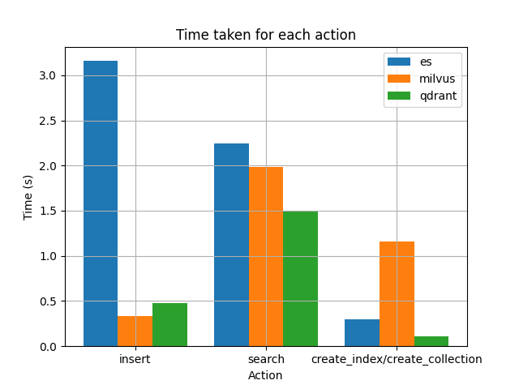
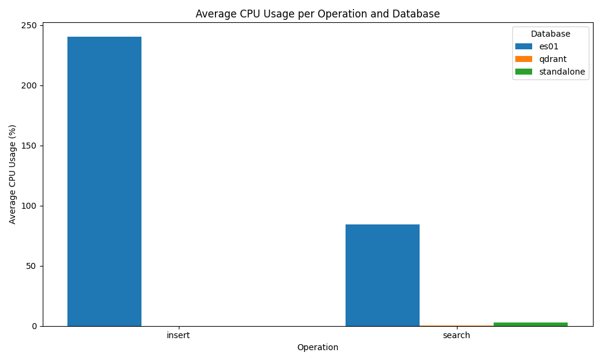

# Personal Benchmark of Databases for RAG tasks
Data from [https://huggingface.co/datasets/rag-datasets/rag-mini-wikipedia](https://www.kaggle.com/datasets/rtatman/questionanswer-dataset/data) subset generation by [https://huggingface.co/datasets/rag-datasets/rag-mini-wikipedia](https://huggingface.co/datasets/rag-datasets/rag-mini-wikipedia).
I have end up with 3200 samples, which were tokenized by the model all-MiniLM-L6-v2, using `SentenceTransformers`. This part of the process wasn't benchmarked.

The Databases tested were:
- Elastic
- Qdrant
- Milvus

There is a docker-compose for all of them, and a `.py` for each, with example usage (althought you might want to tweak some containers better, and use the async clients instead of blocking ones, everything works, and it's all in one place).
Notes to consider:
- Elastic uses indexes, and the other ones use collections (Might be blunt ignorance), hence the index/collection creation grouped operation time.
- Elastic is the only one that's not focused on storing and searching vectors, and it is designed to support massive ammounts of data, so it seems pretty reasonable that for small amount of loadtest like this, it gives some worse usage metrics, it probably needs something stronger than my laptop to run on and scales better that the others (but thats sheers speculation from someone that is still deciding which one to use in prod).

Results:

